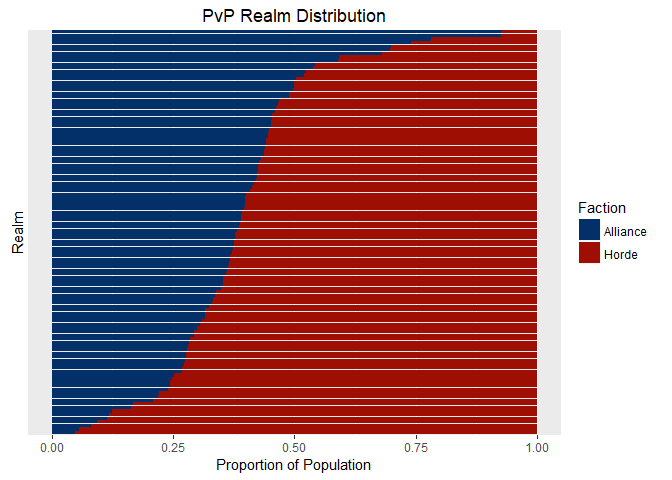
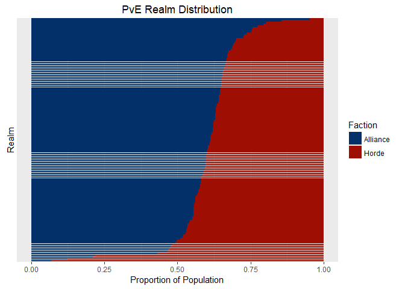
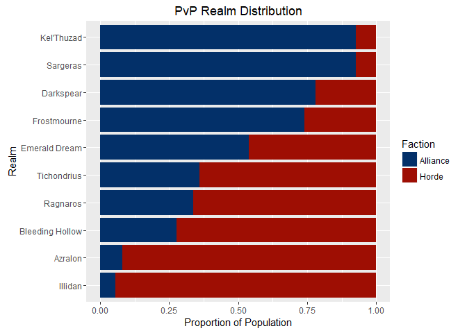
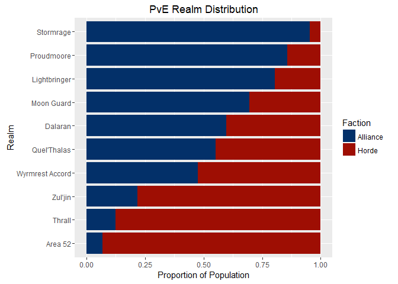

## World of Warcraft Realms & Factions Analysis in R

### Synopsis

As players of WoW know, the game has two opposing factions: the Alliance and the Horde. When creating a character, you can select a race that sides with either of these factions:

* **Alliance**: Human, Dwarf, Night Elf, Gnome, Draenei, Worgen, Pandaren*
* **Horde**: Orc, Undead, Tauren, Troll, Blood Elf, Goblin, Pandaren*

*The Pandaren start out neutral and the player can choose a side later in the game

The player also selects a server, or realm, to play on. Some of these are more populated than others, some are older, and some of them have different play styles. The two playstyles I'll be focusing on in this analysis are PvE and PvP. In PvE realms, you have the option whether or not to do player vs. player combat or not. In PvP realms, you're automatically flagged for it and have a much higher possibility of being killed by a player on the opposing faction side.

Recently I joined a PvP realm for the first time after mostly playing PvE to play with my boyfriend's guild. He encouraged me to choose a Horde character because the Horde presence in that realm was much higher than the Alliance presence. I got used to a fairly half/half ratio on the PvE realm I played on before which got me wondering, are PvP realms more likely to be heavily skewed in favor of one faction over the other? And if so, what does this mean for gameplay?

***

### Load in Realm Population Data from RealmPop.com

The first step was seeking out some population data. How many players are on each realm and how many of them are members of each faction? For the first part of my analysis I decided to look at [RealmPop](http://realmpop.com/us.html), focusing on the US servers.

The data will be taken from the [JSON source](http://realmpop.com/us.json) for RealmPop. It's important to note that the numbers that will be in the analysis from this source do not exactly match the numbers in the generated tables on the main RealmPop page. This is because the source file does not include connected realms (realms across which characters can interact), but the tables on the site do.

The data that will be loaded in for this analysis was scraped from RealmPop. The details of this process can be found [here](http://github.com/idanileiko/WoWFactionAnalysis/tree/master/Scraper), in the scraper part of this repo.


```r
# Load in the data frame; change the timestamp date to match the file that is saved
timestamp <- "10-12-2017"
filename <- paste0("RealmPop_", timestamp, ".Rda")
load(filename)
```

***

### Do PvP and PvE realms have different proportions of factions?

In order to see if PvP realms more likely to be heavily skewed in favor of one faction over the other, I'll separate the data out into PvP realms and PvE realms for making plots. I'll use the `subset` function to do that.

Load in all the packages that will be used in this analysis.


```r
library(reshape2)
library(ggplot2)
```


```r
# Separate into PvP and PvE realms
PvPrealms <- subset(RealmPop, Type == "PvP")
PvErealms <- subset(RealmPop, Type == "PvE")

# Calculate total characters in a realm
totalPvP <- PvPrealms$Alliance + PvPrealms$Horde
totalPvE <- PvErealms$Alliance + PvErealms$Horde

# Convert Alliance and Horde columns into proportions of total characters
PvPrealms$Alliance <- PvPrealms$Alliance / totalPvP
PvPrealms$Horde <- PvPrealms$Horde / totalPvP

PvErealms$Alliance <- PvErealms$Alliance / totalPvE
PvErealms$Horde <- PvErealms$Horde / totalPvE

# Order the data frame by proportion of Alliance characters
PvPrealms <- PvPrealms[order(PvPrealms$Alliance), ]
PvErealms <- PvErealms[order(PvErealms$Alliance), ]
```

In order to get the data frames ready for plotting, we need to use the function `melt` from the `reshape2` package to reformat the data frames from a wide format to a long format.


```r
# Reformat PvP data
PvPdata <- melt(PvPrealms)
names(PvPdata)[6] <- "Faction"
names(PvPdata)[7] <- "Proportion"
PvPdata$RealmName <- factor(PvPdata$RealmName, levels = PvPdata$RealmName)

# Reformat PvE data
PvEdata <- melt(PvErealms)
names(PvEdata)[6] <- "Faction"
names(PvEdata)[7] <- "Proportion"
PvEdata$RealmName <- factor(PvEdata$RealmName, levels = PvEdata$RealmName)
```

<div class = "row">
<div class = "col-md-6">

```r
ggplot(PvPdata, aes(x = RealmName, y = Proportion, fill = Faction)) + 
  geom_bar(stat="identity", position = "stack") +
  coord_flip() + scale_fill_manual(values=c("#033069", "#9e0e03")) +
  labs(title= "PvP Realm Distribution", y = "Proportion of Population", x = "Realm") +
  scale_x_discrete(breaks = NULL)
```

<!-- -->
</div>
<div class = "col-md-6">

```r
ggplot(PvEdata, aes(x = RealmName, y = Proportion, fill = Faction)) + 
  geom_bar(stat="identity", position = "stack") +
  coord_flip() + scale_fill_manual(values=c("#033069", "#9e0e03")) +
  labs(title= "PvE Realm Distribution", y = "Proportion of Population", x = "Realm") +
  scale_x_discrete(breaks = NULL)
```

<!-- -->
</div>
</div>

Let's see some exact numbers on how many realms have faction distributions that are closer to an even split between Alliance/Horde and how many realms have faction distributions that have a more extreme preference toward one faction.

<div class = "row">
<div class = "col-md-6">

```r
# How many realms in PvP have a Alliance/Horde ratio between 0.40 and 0.60?
sum(PvPrealms$Alliance >= 0.40 & PvPrealms$Alliance <= 0.60)
```

```
## [1] 39
```

```r
# How many realms in PvP have a Alliance/Horde ratio under 0.30 or over 0.70?
sum(PvPrealms$Alliance <= 0.30 | PvPrealms$Alliance >= 0.70)
```

```
## [1] 34
```
</div>
<div class = "col-md-6">

```r
# How many realms in PvE have a Alliance/Horde ratio between 0.40 and 0.60?
sum(PvErealms$Alliance >= 0.40 & PvErealms$Alliance <= 0.60)
```

```
## [1] 57
```

```r
# How many realms in PvE have a Alliance/Horde ratio under 0.30 or over 0.70?
sum(PvErealms$Alliance <= 0.30 | PvErealms$Alliance >= 0.70)
```

```
## [1] 16
```
</div>
</div>

It does look like PvP types have slightly more realms that are skewed toward preferring one faction over the other than PvE game types do. Out of 112 PvP realms, 30% of them have Alliance/Horde ratios either under 0.30 or over 0.70. This is contrasted with that out of 134 PvE realms, only 12% of them have Alliance/Horde ratios under 0.30 or over 0.70.


```r
# Stats on populations of PvP and PvE realms
stats <- matrix(c(min(totalPvP), max(totalPvP), mean(totalPvP), median(totalPvP), sd(totalPvP),
                  min(totalPvE), max(totalPvE), mean(totalPvE), median(totalPvE), sd(totalPvE)),
                ncol=2,byrow=FALSE)
colnames(stats) <- c("PvP","PvE")
rownames(stats) <- c("minimum", "maximum", "mean", "median", "sd")
stats <- as.table(stats)

stats
```

```
##               PvP       PvE
## minimum   28752.0   81239.0
## maximum 1016719.0 1020872.0
## mean     150556.0  178273.5
## median    84079.5  122632.0
## sd       190190.0  152760.1
```

PvP realms have a wider distribution of population numbers, seen by the larger standard deviation. But both game types have realms that have less than 100 thousand players and realms that have more than 1 million players. Let's look at the more populated realms in both game types, since those have more players that are making a race/faction choice.


```r
# Add a total population column to the original data frame
RealmPop$Total <- RealmPop$Alliance + RealmPop$Horde

# Subset by PvP and PvE again
PvPpop <- subset(RealmPop, Type == "PvP")
PvEpop <- subset(RealmPop, Type == "PvE")

# Get the 10 most populated PvP realms
PvPpop <- PvPpop[order(PvPpop$Total), ]
PvPpopTop <- tail(PvPpop, 10)
# Subset PvP data for graphing by the top populated realms
PvPdataTop <- PvPdata[PvPdata$RealmName %in% PvPpopTop$RealmName, ]

# Get the 10 most populated PvE realms
PvEpop <- PvEpop[order(PvEpop$Total), ]
PvEpopTop <- tail(PvEpop, 10)
# Subset PvE data for graphing by the top populated realms
PvEdataTop <- PvEdata[PvEdata$RealmName %in% PvEpopTop$RealmName, ]
```

Let's make similar graphs as before but having fewer realms will make it easier to read.

<div class = "row">
<div class = "col-md-6">

```r
# Plot of faction proportions for PvP top population data
ggplot(PvPdataTop, aes(x = RealmName, y = Proportion, fill = Faction)) + 
  geom_bar(stat="identity", position = "stack") +
  coord_flip() + scale_fill_manual(values=c("#033069", "#9e0e03")) +
  labs(title= "PvP Realm Distribution", y = "Proportion of Population", x = "Realm")
```

<!-- -->
</div>
<div class = "col-md-6">

```r
# Plot of faction proportions for PvE top population data
ggplot(PvEdataTop, aes(x = RealmName, y = Proportion, fill = Faction)) + 
  geom_bar(stat="identity", position = "fill") +
  coord_flip() + scale_fill_manual(values=c("#033069", "#9e0e03")) +
  labs(title= "PvE Realm Distribution", y = "Proportion of Population", x = "Realm")
```

<!-- -->
</div>
</div>

With only 10 realms per game type, there's actually no obvious pattern for the most populated realms. Both PvP and PvE have a number of realms in which one faction dominates over the other. PvE does slightly have more evenly balaned populous realms (3/10 have an Alliance/Horde ratio between 0.40 and 0.60 vs. 1/10 for PvP) but it's difficult to draw general conclusions from this small set.

***

### Do PvP realms have more Horde characters?

The evidence for one faction dominating the other in PvP realms is not perfectly clear-cut. Both the PvP and PvE realm types have realms that are closer to an even split, as can be seen in the graphs in the previous section. However, a trend I noticed in the figures was it seems like Horde players are a lot more prevalent in PvP realms than in PvE realms.

Let's see what the proportion is of Alliance and Horde characters on both types of realms.


```r
# Number of Horde & Alliance Numbers on the realms
factionNum <- matrix(c(sum(PvPpop$Alliance), sum(PvPpop$Horde), sum(PvEpop$Alliance), sum(PvEpop$Horde)),
                     ncol=2,byrow=FALSE)
colnames(factionNum) <- c("PvP","PvE")
rownames(factionNum) <- c("Alliance", "Horde")
factionNum <- as.table(factionNum)
factionNum
```

```
##               PvP      PvE
## Alliance  6942566 14024171
## Horde     9919710  9864479
```

```r
# Proportion of Horde & Alliance Numbers on the realms
factionPop <- matrix(c(sum(PvPpop$Alliance)/sum(PvPpop$Total), sum(PvPpop$Horde)/sum(PvPpop$Total),
                  sum(PvEpop$Alliance)/sum(PvEpop$Total), sum(PvEpop$Horde)/sum(PvEpop$Total)),
                ncol=2,byrow=FALSE)
factionPop <- round(factionPop,3)
colnames(factionPop) <- c("PvP","PvE")
rownames(factionPop) <- c("Alliance", "Horde")
factionPop <- as.table(factionPop)
factionPop
```

```
##            PvP   PvE
## Alliance 0.412 0.587
## Horde    0.588 0.413
```

This is really interesting. The ratios of Alliance to Horde characters is almost exactly reversed. PvE realms have more players in total, since there are more PvE realms (134 vs. 112 PvP ones). Despite that, there are around the same number of Horde characters on both, a little under 10 million. However, there are about double the Alliance characters on PvE realms (around 14 million vs. around 7 million for PvP realms).

***

### Conclusions and future analysis

So what conclusions can we draw from this data and why does it matter? 

The first question I asked for this analysis was "Are PvP realms skewed toward prefering one faction over the other?". It did seem that although the evidence was not obviously in favor or against this conclusion, PvP realms did slightly have more extreme Alliance/Horde ratios. What does this say about people? Perhaps when joining a realm in which a player is more likely to fight other players that are on the opposing faction, they want to choose a side that is more in control to avoid being dominated by the other side. This means that if most people behave in this way, the proportions of Alliance/Horde ratios are going to keep getting more extreme as time goes on. Something I may look at here is seeing if instead of the more populated realms, the realms that are older are more likely to favor one faction over another. What does this mean for the game? Depends on what the goals of the PvP realms are. If the goal is to make these realms more balanced, perhaps something should be done to encourage new character creation or realm transfer of existing characters that are the less represented faction. This could be in the form of some promotional gifts (pets, mounts, etc.) or just slightly cheaper realm transfer into specific realms. If the goal is to encourage one side dominating the other (unlikely), then let time run its course until more realms have extreme ratios.

The second question I asked for this analysis was "Do PvP realms have more Horde characters?". The Horde/Alliance ratios shown in the previous section say that yes, PvP realms are skewed toward Horde characters but PvE realms are skewed toward Alliance characters. Why is this? Do the types of players who select Horde races prefer to play on PvP realms? And the types of players who select Alliance races prefer to play on PvE realms? What is it about player behavior that governs these choices? To answer this, I'd want to look at the specific races that are chosen and see if more intimidating-looking races (e.g. Orcs, Undead, etc.) are chosen on PvP realms than on PvE ones. Maybe this result is because of the way the Horde has been portrayed in cinematics and in previous expansions that makes them seem like the "bad guys"? Again, if the goal is to balance this out on both types of realms, then maybe the next (if there are any!) races for the Alliance need to look or seem more intimidating so that they'll be selected for the PvP realms. Or more questions need to be asked about the playstyles of people who choose to play mostly Horde vs. people who choose to play mostly Alliance.
